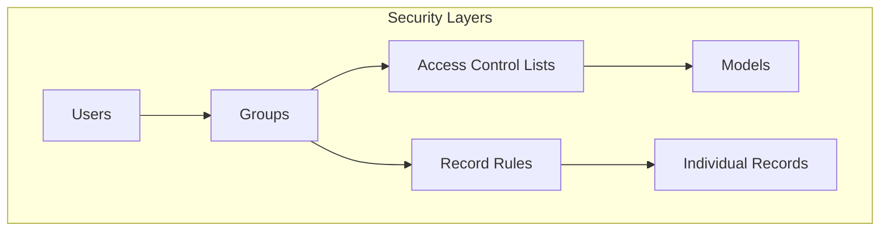

# Security

Access control and security definitions in auth_partner.

## Access Control Lists (ACLs)

Model access permissions defined in:
- **[ir.model.access.csv](../auth_partner/security/ir.model.access.csv)**
  - 7 model access rules

## Record Rules

Row-level security rules defined in:
- **[ir_rule.xml](../auth_partner/security/ir_rule.xml)**

## Security Groups & Configuration

Security groups and permissions defined in:
- **[ir_rule.xml](../auth_partner/security/ir_rule.xml)**
- **[res_group.xml](../auth_partner/security/res_group.xml)**
  - 2 security groups defined

Security files overview:
- **[ir.model.access.csv](../auth_partner/security/ir.model.access.csv)**
  - Model access permissions (CRUD rights)
- **[ir_rule.xml](../auth_partner/security/ir_rule.xml)**
  - Security groups, categories, and XML-based rules
- **[res_group.xml](../auth_partner/security/res_group.xml)**
  - Security groups, categories, and XML-based rules

Notes
- Access Control Lists define which groups can access which models
- Record Rules provide row-level security (filter records by user/group)
- Security groups organize users and define permission sets
- All security is enforced at the ORM level by Odoo
