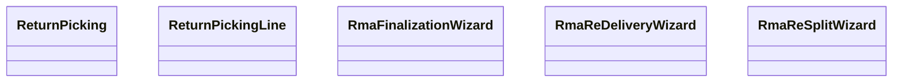

# Wizards

Transient models exposed as UI wizards in rma.

```mermaid
classDiagram
    class ReturnPicking
    class ReturnPickingLine
    class RmaFinalizationWizard
    class RmaReDeliveryWizard
    class RmaReSplitWizard
```
